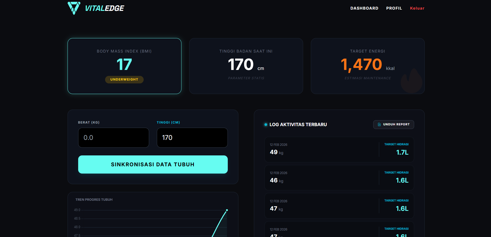
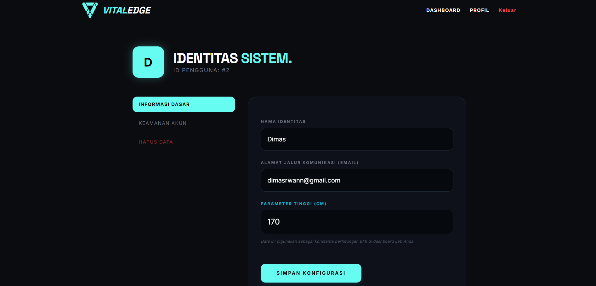

# ⚡ VitalEdge - Biometric & Health Dashboard

VitalEdge adalah sistem manajemen kesehatan pribadi berbasis web yang dirancang dengan antarmuka **Cyber-Minimalist**. Sistem ini memungkinkan pengguna melacak metrik tubuh (berat, tinggi, BMI) dan target hidrasi harian secara efisien dalam lingkungan terminal futuristik.

---

## 📱 Interface Preview

Berikut adalah tampilan antarmuka sistem VitalEdge yang telah dikembangkan:

  
📸 Klik untuk memperkecil/memperbesar galeri

   
  
  ### Dashboard Terminal
  
  
  ### Identity Protocol (Profile)
  

---

## ✨ Fitur Utama

- **Dashboard Biometrik**: Visualisasi BMI dan target kalori harian secara real-time berdasarkan data tubuh terbaru.
- **Tren Progres**: Grafik interaktif menggunakan Chart.js untuk memantau perubahan berat badan secara visual.
- **Laporan PDF**: Fitur ekspor riwayat kesehatan ke dokumen PDF yang rapi dan siap cetak.
- **Identity Terminal**: Manajemen profil pengguna (Update Profil & Password) dengan tema gelap dan aksen neon.
- **Master Archives**: Log lengkap riwayat biometrik dengan sistem navigasi dan tabel yang informatif.

## 🛠️ Tech Stack

- **Framework**: Laravel 12
- **Styling**: Tailwind CSS
- **Library**: DomPDF (Export PDF), Chart.js (Grafik)
- **Database**: MySQL

## 🚀 Cara Instalasi

1. **Clone repositori**:  
   `git clone https://github.com/username/vitaledge.git`
2. **Install dependencies**:  
   `composer install` dan `npm install`
3. **Konfigurasi Environment**:  
   Salin file `.env.example` menjadi `.env` dan sesuaikan pengaturan database Anda.
4. **Generate App Key**:  
   `php artisan key:generate`
5. **Migrasi Database**:  
   `php artisan migrate`
6. **Jalankan Aplikasi**:  
   `php artisan serve` dan `npm run dev`

---

## 📄 Lisensi

Proyek ini dikembangkan untuk tujuan pembelajaran dan portofolio pribadi.
